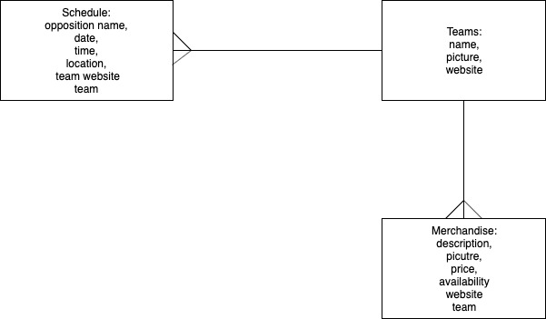
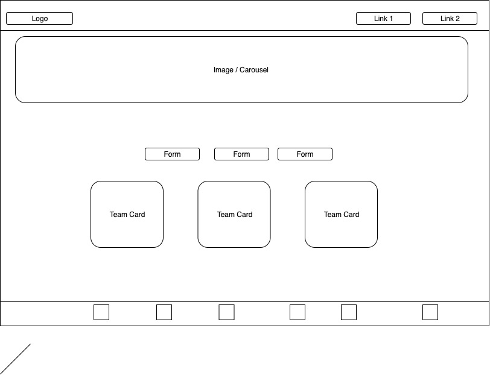
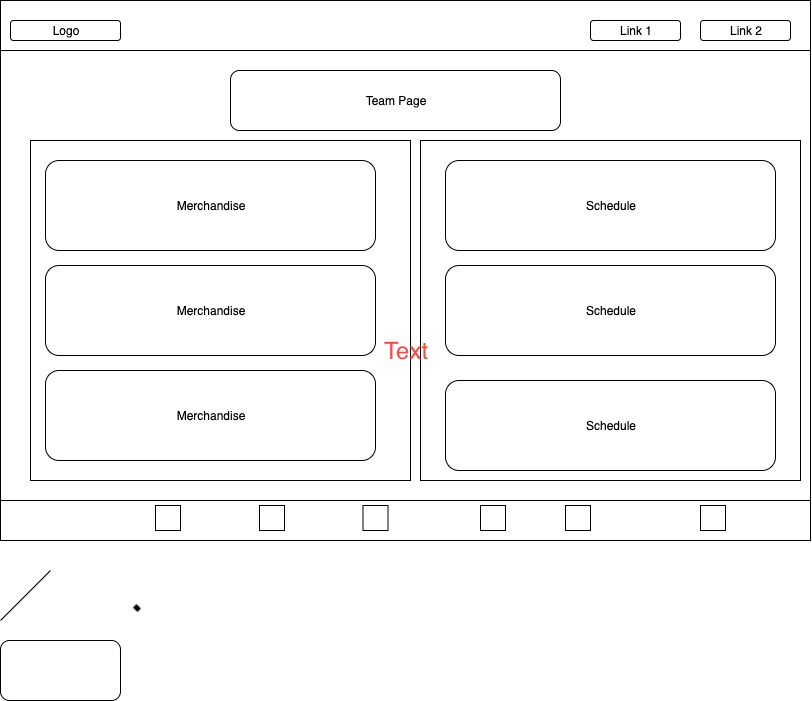
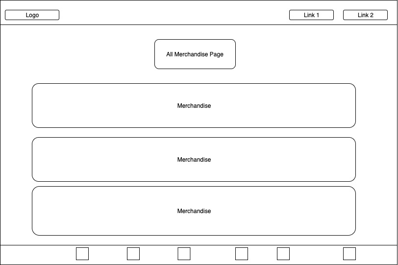
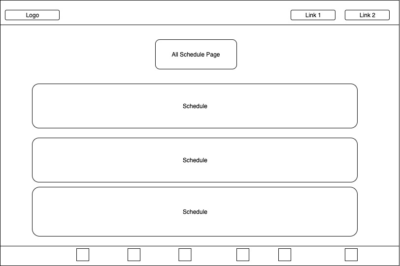

# General Assembly SEI - Project 4

* [Deployed App](https://evening-depths-32851.herokuapp.com/)
* [Project Board](https://github.com/dipoosinubi/project4/projects/1)

## Overview

The goal of this application was to create a full stack application using a Django database and a React frontend. Super Footy was created as an application for soccer fans to find all their soccer needs in one location as opposed to having to visit multiple websites. Super Footy has a collection of merchandises and game schedules, already curated, as well as tables of all the major soccer leagues. Fans are also provided the choice of shopping by teams or simply going through the entire catalog. 

## Technologies Used:
* React
* Django
* Python
* Material Ui
* Bulma
* ReactStrap
* CSS

## Version 2 Goals:
* Apply search functionality 
* Add google maps to show location of stadiums
* Sort merchandise by price 

## ERD

## Wireframes

